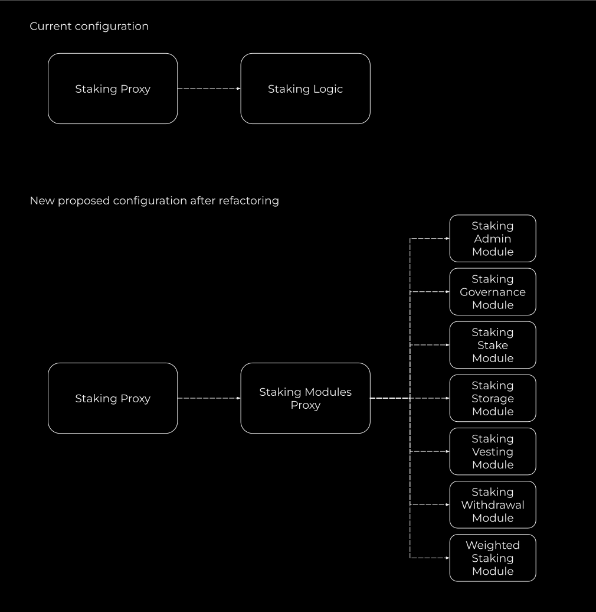

# SIP-0049: Staking contract refactoring and other improvements  

## Description  

### The Staking contract had a series of issues fixed in this SIP  

1. The Staking contract has reached the EIP-170 solidity contracts size limits.  
  
2. The Staking contract is vulnerable to voting power theft. It is possible to steal the voting power associated with a specific stake by staking an arbitrarily small amount of SOV for the user at the same date and at the same time passing a new delegate as a parameter. As a result, the complete voting power of this stake is delegated to the passed delegate address.  
  
3. The staking contract has an incorrect vesting stake for all of the lock dates for which the new 4 year vesting contracts were deployed, because of a wrong order of code execution during the deployment. As a consequence, it is not possible to withdraw the full amount of vested SOV on these lock dates. This SIP introduces a method which allows us to correct the vesting stake at these dates.  
  
4. The guard against multiple manipulations of the same stake on a single transaction can be circumvented, because it is checking for the message sender address instead of the address to which the stake actually belongs. 
  
### The SIP also includes the following improvements  

- stakeBySchedule function of the staking contract which is used by the vesting contracts to stake the vested tokens uniformly over a certain number of intervals, was making a token transfer for each interval which is not a gas-efficient way. It is redesigned to have only one token transfer per operation which effectively saves 7610 gas per vesting interval.
  
- Governance Vesting withdraw function was unable to withdraw team vested tokens in some cases where there are too many stakes to iterate running into a block gas limit. It was refactored and the flow also improved to exclude redundant function calls between Staking and Vesting contracts.

- Staking with Approval functionality is reintroduced. It used to be commented out as a workaround to fit into EIP-170 24 KB contract size limit.

- Some inconsistencies regarding lock date adjustments were resolved.

If approved, this SIP will replace the Staking Logic contract in the Staking Proxy contract for the new StakingModulesProxy contract which proxies  calls to the Staking logic functions grouped into meaningful module contracts. Therefore refactoring does not change any staking contract logic except for the listed above improvements and fixes.

## Motivation

- Staking contract logic hit the EIP-170 contract code size limit which does not allow adding any functionality to it.  

- There were two long awaited to be resolved issues with the stakeBySchedule function and Governance team vesting withdraw function.  

- Immunefi bug bounty program report from a security researcher discovered a voting power theft vulnerability. 

- Staking contract has been given a thorough internal review which discovered missing test cases to guard from potential vulnerabilities.

## Details

In order to resolve the issues, a new modular contracts system using the same verified and audited architecture as the loan token and perp swap contracts was designed and implemented.  

- The new reusable ModulesProxy contract forwards all the Staking logic function calls to the respective module contracts.

- 7 new module contracts contain subsets of the large Staking contract functionality.
<!---->
&nbsp;&nbsp;&nbsp;&nbsp;&nbsp;&nbsp;&nbsp;

## Proposed change  

Existing Staking Logic contract: [0x81570497e763809900A8e91c8DaF3020085e43aB](https://explorer.rsk.co/address/0x81570497e763809900A8e91c8DaF3020085e43aB)
  
New Staking Modules Proxy contract: [0x...](https://explorer.rsk.co/address/0x...)

Staking logic module contracts: 
- StakingAdminModule: [0x...](https://explorer.rsk.co/address/0x...)  
- StakingGovernanceModule: [0x...](https://explorer.rsk.co/address/0x...)  
- StakingStakeModule: [0x...](https://explorer.rsk.co/address/0x...)  
- StakingStorageModule: [0x...](https://explorer.rsk.co/address/0x...)  
- StakingVestingModule: [0x...](https://explorer.rsk.co/address/0x...)  
- StakingWithdrawModule: [0x...](https://explorer.rsk.co/address/0x...)  
- WeightedStakingModule: [0x...](https://explorer.rsk.co/address/0x...)  

Proposed changes: [https://github.com/DistributedCollective/Sovryn-smart-contracts/pull/448](https://github.com/DistributedCollective/Sovryn-smart-contracts/pull/448)

## License
Copyright and related rights waived via [CC0](https://creativecommons.org/publicdomain/zero/1.0/).
